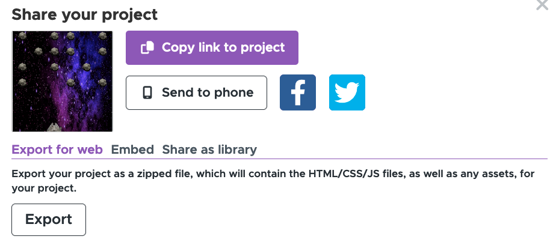

# Workshop Sviluppo App - BitPrepared

Questo workshop é pensato per un gruppo di 5/6 guide/esploratori fra il terzo e il quinti anno di reparto.

I ragazzi avranno la possibilità di imparare i **concetti di base della programmazione** e realizzare una **serie di app** di esempio. Le app verranno poi condivise con gli altri ragazzi e saranno rese disponibili in modo che chiunque le possa scaricare sul CD finale.

- [Workshop Sviluppo App - BitPrepared](#workshop-sviluppo-app---bitprepared)
  - [Metariale](#metariale)
  - [Code.org](#codeorg)
  - [Preparazione](#preparazione)
  - [Momento 0 - Questionario pre-campo](#momento-0---questionario-pre-campo)
  - [Momento 1 - The Hour of Code](#momento-1---the-hour-of-code)
    - [Esempio 1 - La Torta](#esempio-1---la-torta)
    - [Esempio 2 - Il Robot](#esempio-2---il-robot)
      - [if-then-else](#if-then-else)
      - [ciclo-while](#ciclo-while)
    - [Guerre Stellari: Costruisci una Galassia con il codice](#guerre-stellari-costruisci-una-galassia-con-il-codice)
    - [Altre ore del codice](#altre-ore-del-codice)
  - [Momento 2 - Calculator](#momento-2---calculator)
  - [Momento 3 - Design App](#momento-3---design-app)
  - [Momento 4 - Implementazione App](#momento-4---implementazione-app)
  - [Momento 5 (Jolly) - App Debugging](#momento-5-jolly---app-debugging)
  - [Installare le App sui Raspberry Pi.](#installare-le-app-sui-raspberry-pi)
  - [Appendice - Materiale Workshop 2022](#appendice---materiale-workshop-2022)
    - [Music Box](#music-box)
    - [Canzoniere](#canzoniere)
  - [Glossario per i ragazzi](#glossario-per-i-ragazzi)

## Metariale

* Un computer con mouse e tastiera per ogni ragazzo connesso ad internet.
* Un account su code.org configurato (vedi sotto).
* Cartellone e pennarelli.
* PRBMM sui tablet (almeno un tablet ogni 2).

## Code.org

Tutto il workshop si basa sull'utilizzo del sito [Code.org](http://code.org) che permette di introdurre il concetto di **programmazione a blocchi**.

Prima del workshop é consigliato prendere dimestichezza con il sito e con il metodo di programmazione a blocchi (completare 1/2 corsi dovrebbe essere sufficiente)

## Preparazione

1. Creare un account personale su Code.org (entrare con Google é probabilmente la soluzione piu' veloce). 
2. Creare una classe dal seguente link [https://studio.code.org/home#](https://studio.code.org/home).

3. Selezionare accesso con immagini
4. Selezionare il corso **Guerre Stellari: Costruisci una Galassia con il codice**
5. Aggiugnere i ragazzi nella classe
6. Stampare le password di acesso 

Avere una classe su Code.org e' molto utile perche':

* Non forza i ragazzi a creare un account su Code.org.
* Perme di gestire in modo centrallizato la classe e controllare i progressi dei ragazzi.
* Permette di raccogliere in un unico punto tutte le app realizzate dai ragazzi.

## Momento 0 - Questionario pre-campo

Ai ragazzi viene chiesto di compilare un questionario pre-campo. Questo questionario serve a capire il livello di preparazione dei ragazzi e a capire se ci sono ragazzi che hanno gia' fatto un po' di programmazione:

1. Quali conoscenze informatiche hai?
2. Hai mai programmato? In quale linguaggio?
3. Se sì, che progetto hai fatto? Ce lo condivideresti?

## Momento 1 - The Hour of Code

Durante il primo momento, i ragazzi dovranno completare il corso **The Hour of Code (l'ora del codice)**. Questo corso ha la durata di un ora ed ha lo scopo di introdurre i ragazzi alla programmazione presupponenzo nessuna conoscenza informatica.

Prima di inizare a programmare, è necessario introdurre ai ragazzi il concetto di programmazione.

Qui qualche paragone per far avvicinare i ragazzi alla programmazione

### Esempio 1 - La Torta

Spiegare che in sostanza ogni programma é costituito da 3 cose. Uno stato
iniziale, una serie di istruzioni, e una stato terminale.

Calato sulla torta questi sarebbero gli ingredienti (stato iniziale),
la ricetta (istruzioni), e la torta (il risultato).

Far capire che il programma e' una specie di robot che esegue la ricetta, noi gli mettiamo dentro i dati in ingresso (gli ingredienti) e lui lavora... e ci tira fuori il risultato (la torta).

Calato su star wars i dati di ingresso e' la mappina e la posizione
del droide, il programma e' quello che loro scrivono, e il risultato e
lo stato terminale in cui si trovano i personaggi.

### Esempio 2 - Il Robot

Immagina di avere un robot umanoide che ti deve aiutare durante la
vita di tutti i giorni. Partiamo dal presupposto che questo robot e'
stupido... gli devono venire spiegate tutte le cose per filo e per
segno.

Adesso vuoi che il robot ti aiuta e faccia da maggiordomo (tipo Emilio).
Questo esempio introduce il concetto di _if-then-else_ e di _ciclo-while_.

#### if-then-else
Immagina di essere in cucina con la porta chiusa e di chiamare il robot.
Lo chiami, lui arriva. Se il robot non sa come aprire la porta, molto
probabilmente potrebbe sbatterci contro e romperla. Per questo motivo
e' necessario introdurre una condizione. Un esempio di piccolo
programma potrebbe essere.

```
alzati_in_piedi()
cammina_verso_il_salotto()
if (porta_chiusa) then {
   apri_la_porta()
}
attraversa_la_porta()
```

#### ciclo-while

Immagina di essere in salotto che stai guardando un film. Il robot ti
chiede se hai bisogno di qualcosa, e tu vuoi che non ti disturbi per
un ora... Il robot fara' un ciclo per aspettare che il tempo passi e
poi chiedera' nuovamente se hai bisogno di qualcosa. Esempio:

```
while(il_robot_e'_acceso()){
    chiedi_se_ha_bisogno();
    if (ha_bisogno()){
       aiuta()
    } else {
       while(non_e'_passata_un_ora()){
           aspetta_qualche_minuto()
       }
    }
}
```

### Guerre Stellari: Costruisci una Galassia con il codice

Far fare ai ragazzi l'ora del codice su star wars.

La cosa interessante da far notare e' che introduce alla
**Programmazione ad Eventi**. In sostanza si definisce cio' che deve
succedere ogni volta che l'utente genera un evento.

Nel caso di star wars un evento e' "Quando si preme sulla freccia
verso sinistra" o simili. Nel caso di un'app un evento e' "Quando si
preme sul bottone OK".

Questo e' molto importante perche' l'app che i ragazzi andranon a fare si basa sulla programmazione ad eventi. I ragazzi dovranno definire una serie di bottoni, oggetti grafici, etc. e poi si va a dire cosa deve succedere ogni
volta che l'utente ne preme uno, etc.

### Altre ore del codice

É probabile che alcuni ragazzi abbiano già fatto il corso a scuola e quindi ci metteranno molto di meno nel completarlo.

Qui suggerimenti per altri due corsi che aiuteranno nello sviluppo dell'app:

* [Ora del codice: Artista](https://studio.code.org/s/artist)
Questo e' molto carino e permette ai ragazzi di disegnare programmando.

* [Ora del codice con Frozen](https://studio.code.org/s/frozen/)
Questo e' abbastanza simile a quello di StarWars ma comunque valido.

## Momento 2 - Calculator

Durante il momento 2 i ragazzi creeranno una semplice app Calcolatrice. Il momento due e' strutturato in questo modo:

* Introdure l'ambiente di App Lab [https://code.org/educate/applab](https://code.org/educate/applab)
* Creare una semplice app
* Mostrare come aggiungere bottoni, caselle di testo ed blocchi di testo
* Creare un app semplice che faccia la somma di due numeri al proiettore
* Spiegare tutto passo per passo
* Chiedere ai ragazzi di implementare la stessa calcolatrice pero' avendo somma, sottrazione, moltiplicazione, divisione.

[Codice dell'app Calcolatrice](https://studio.code.org/projects/applab/BMW7hvFJ8vznNm4SwDZC266zh7mi1UfB221h_pYZG8A)

Non e' necessario che tutti arrivino a finire la calcolatrice in tempo con tutte le operazioni, ma almeno la somma deve essere implementata.

## Momento 3 - Design App

In questo momento c'e' da far fare ai ragazzi un po' di brainstorming per realizzare l'app che andra' a far parte della caccia al tesoro.

E' importante che l'app sia semplice e che possa essere completata dai ragazzi.
Cose da fare attenzione durante il brainstorming:

* L'app non deve essere troppo complessa (es. un videogioco e' troppo complesso).
* Raccogliere l'idee dei ragazzi e cercare di semplificarle in quello che sia effettivamente realizzabile, senza andare a distruggere la loro creativita'.
* Fra tutti i gruppi deve esserci un minimo di varietà (es. non vogliamo 5x cluedo).
* Assicurarsi che i ragazzi riescano a dividere il lavoro e che tutti abbiano qualcosa da fare.

I ragazzi usano il quaderno per disegnare l'interfaccia dell'app e scrivere le funzionalita' che deve avere.

## Momento 4 - Implementazione App

Durante il momento 4 si va ad implementare l'app che i ragazzi hanno disegnato.

Esempi di App realizzate in passato:

* [App 1 - Space Shooter](https://studio.code.org/projects/applab/Ot20uAhNagNig0WI24g-ZG0S3G6pPAt3wPOFjsKR3lM/edit)
* [App 2 - Gioco dell'Oca](https://studio.code.org/projects/applab/lFWewHIBZcbSjex_PwLURaHJ8H1MulowZKuaON3TMx8/edit)
* [App 3 - Stick fighter](https://studio.code.org/projects/applab/97dJjpWIv1BsnWcClO81NqHFTT_82jztNKxTJZAO9NY/edit)
* [App 4 - Cluedo](https://studio.code.org/projects/applab/ChxIU0MgVtepveS0aHrxSsaL9vQI_TGfoCq3lz8QDxU/edit)

Assicurarsi che i ragazzi che si occupano della grafica e dell'audio:
* Utilizzino sono png, jpg o gif (**non svg**).
* Utilizzino solo file audio in formato mp3.
* Non mandino file troppo pesanti che senno' ci mettono troppo a caricare.

## Momento 5 (Jolly) - App Debugging

Se avanza tempo o c'e' da riempire dei buchi, e' possibile far fare ai ragazzi un attivita' di bug reporting di PRBMM.

I ragazzi avranno gia' usato il PRBMM durante le loro missioni, quindi possono raccontare la loro esperienza.

Far scrivere sul cartellone tutti i bug che hanno incontrato. Dopo circa 10/15 minuti di brainstorming passare alla fase di priotarizzazione.

* Rosso: Molto importante - Impatta l'esperienza utente
* Giallo: Medio - Presenta alcune problematiche ma puo' essere aggirato
* Verde: Basso - Nice to have

Spiegare ai ragazzi i concetti di priorita' e far assegnare a loro le priorita'. 

## Installare le App sui Raspberry Pi.

Per installare le app in locale sui Raspberry Pi, e' necessario:

1. Selezionare "Share" dall'editor di AppLab.
2. Selezionare l'opzione "Export for Web" (vede immagine):
3. Assicurarsi che tutti i link funzionino nel server locale.



## Appendice - Materiale Workshop 2022

In passato veniva data liberta' ai ragazzi di scegliere cosa fare durante il momento 3. 
Questo ha portato a risultati molto variabili. Alcuni ragazzi hanno fatto delle app molto complesse..

Si parte mostrando alcune app di esempio ai ragazzi (vedi sotto), spiegando alcune funzioni _avanzate_ di AppLab. I ragazzi devono scegliere se:

* Finire e migliorare la loro calcolatrice
* Re-implementare uno dei progetti consigliati
* Creare un'app ex-novo partendo da una loro idea.

E' molto importante capire il livello dei ragazzi e assicurarsi che ognuno stia facendo qualcosa di adeguato alle proprie capacita'.

Se il livello generale e' troppo basso, valutare di non lasciare liberta' ai ragazzi ma consigliare solamente un'app da re-implementare.

Qui un elenco di app che ho scritto su AppLab e che possono essere utili per i ragazzi come idea da re-implementare.

### Music Box


[Codice Sorgente Musicbox](https://studio.code.org/projects/applab/xWSObAhlbYO5gReJ303ct-5IalL5Gz5m-YyQmvP-Qc0)

Questa e' carina perche' e' in tema Star Wars ed utilizza immagini e musiche.

L'app consiste in una serie di bottoni con immagini per ogni personaggio di star wars. Alla pressione del pulsante un suono deve essere riprodotto.

**IMPORTANTE**: Assicurarsi di avere a disposizione gli assett (immagini/audio) da condividere sulla cartella per i ragazzi (si possono scaricare dall'app).

### Canzoniere


[Codice Sorgente Canzoniere](https://studio.code.org/projects/applab/l9mHY61G9sF27C7zFKzD6TLDCrbWpxNqRMDJO2vAzO8)

L'app canzoniere e' piu' complessa. Utilizza un DB chiave/valore per salvare alcune canzoni scout. Permette ai ragazzi di visulizzare la lista di canzoni ed eventualmente di aggiungerne di nuove.

**IMPORTANTE**: Assicurarsi che i ragazzi che la vogliano implementare siano abbastanza in gamba in modo da non rimanere bloccati.

## Glossario per i ragazzi

* **Informatica**: La scienza che si occupa di elaborare le informazioni che si ricevono, e successivamente di inviarle al destinatario.
* **Programmazione**: Il processo di creare istruzioni per far svolgere compiti a un computer.
* **Algoritmo**: Una sequenza di istruzioni che permettono di risolvere un problema o di eseguire un compito. Un algoritmo può essere visto come una “ricetta” da seguire per realizzare qualcosa.
* **Programma**: Un insieme di istruzioni utili per eseguire una serie di operazioni specifiche su un computer.
* **Linguaggio** di programmazione: Un insieme di regole e simboli utilizzati per scrivere programmi che i computer possono comprendere ed eseguire.
* **Cartella** compressa: Un file che contiene uno o più file e/o cartelle che sono stati compressi per ridurre le dimensioni complessive. Il formato di compressione più comune è ".zip". Il grande vantaggio delle cartelle compresse rispetto alle cartelle normali è che possono essere inviate via mail o via messaggio come se fossero dei normali file.
* **Scratch**: Un ambiente di programmazione visuale utilizzato per insegnare i concetti di programmazione a chi sta muovendo i primi passi in questo mondo. Viene utilizzato per scrivere del codice più facilmente.
* **JavaScript**: Un linguaggio di programmazione comunemente usato per aggiungere interattività e dinamicità alle pagine web. Si dice che JavaScript è un linguaggio "orientato a eventi".
* **Evento**: Un'azione o un'occasione significativa che si verifica in un programma. Gli eventi possono includere l'interazione dell'utente con un'interfaccia grafica, come clic del mouse o pressioni di tasti, o possono essere generati internamente dal programma stesso, come il completamento di un'operazione o il verificarsi di un errore. JavaScript permette di gestire gli eventi, cioè consente al programmatore di associare ad un evento gli avvenimenti desiderati.
* **IDE** (Integrated Development Environment) (Ambiente di sviluppo Integrato): Un software che fornisce strumenti per scrivere, testare e debuggare programmi. Per esempio code.org.
* **Variabile**: Un'area di memoria utilizzata per memorizzare e manipolare dati in un programma. Essa può variare nel corso del programma.
* **Costante**: Un valore fisso che non cambia durante l'esecuzione del programma.
* **Stringa**: Una sequenza di caratteri, come lettere, numeri, spazi o simboli, all'interno di un programma. Le stringhe sono comunemente utilizzate per rappresentare testo. Possono essere delimitate da virgolette singole (' ') oppure virgolette doppie (" "): questi due simboli sono intercambiabili.
* **Vettore** o array: Una struttura di dati che contiene una sequenza ordinata di elementi dello stesso tipo.
* **Matrice**: Una struttura di dati bidimensionale composta da righe e colonne di elementi dello stesso tipo.
* **Condizione**: Una dichiarazione che viene valutata come vera o falsa, determinando il flusso di esecuzione del programma. Viene usata nelle strutture condizionali if else e nei cicli while e for.
* **Struttura** condizionale: Una parte del codice che consente di eseguire istruzioni diverse in base al verificarsi di determinate condizioni. Comunemente realizzata con l'istruzione "if-else", permette al programma di prendere decisioni e di eseguire determinate azioni in base allo stato dei dati o agli input forniti.
* **Ciclo** (in inglese: "loop"): Una struttura di controllo che ripete un blocco di istruzioni finché una condizione è vera.
* **Funzione**: Un blocco di istruzioni o di codice che esegue una specifica operazione o compito all'interno di un programma più grande. Le funzioni sono utilizzate per organizzare e riutilizzare il codice, migliorando la leggibilità e la manutenibilità del programma. Possono accettare input, chiamati argomenti (i quali devono soddisfare i parametri richiesti), eseguire operazioni su di essi e restituire un risultato. Le funzioni possono essere chiamate più volte all'interno di un programma per eseguire lo stesso compito su dati diversi.
* **Documentazione**: Un insieme di informazioni, istruzioni e spiegazioni che descrivono come utilizzare un software, una libreria o un linguaggio di programmazione. La documentazione fornisce ai programmatori tutte le informazioni necessarie per comprendere il funzionamento di un prodotto software e per utilizzarlo correttamente. Include spesso esempi di codice, descrizioni delle funzioni e dei metodi disponibili, requisiti di sistema e altre informazioni utili.
* **Debug**: Il processo di individuazione, analisi e risoluzione o di errori, warning o bug che appaiono nel programma.
* **Errore**: Un problema nel codice che impedisce al programma di essere eseguito.
* **Bug**: Un difetto nel programma che causa un comportamento indesiderato o imprevisto. È meno grave di un errore perchè almeno il programma è possibile eseguirlo.
* **Warning**: Un avviso generato dal compilatore o dall'interprete che indica un possibile problema nel codice, ma che non impedisce l'esecuzione del programma. A volte i warnings sono utili, a volte danno solo fastidio. Si consiglia comunque di leggerli quando vengono segnalati.
* **Interprete**: Un programma che legge ed esegue istruzioni scritte in un linguaggio di programmazione senza tradurle in linguaggio macchina. L'interprete esegue le istruzioni una alla volta mentre il programma è in esecuzione. Non genera dunque nessun file eseguibile, non ne ha bisogno.
* **Commento**: Una porzione di testo all'interno del codice sorgente di un programma che non viene eseguita dal computer. I commenti sono utilizzati per spiegare il funzionamento del codice, fornire istruzioni per l'uso, documentare le modifiche apportate o semplicemente per rendere più comprensibile il codice ad altri programmatori. Nei linguaggi di programmazione, i commenti sono tipicamente preceduti da un simbolo o una sequenza di caratteri specifici che indicano al compilatore o all'interprete di ignorare il testo fino alla fine della riga. In JavaScript, i commenti su un'unica riga devono essere preceduti da un '//', mentre i commenti su più righe devono essere racchiusi tra /* e */.